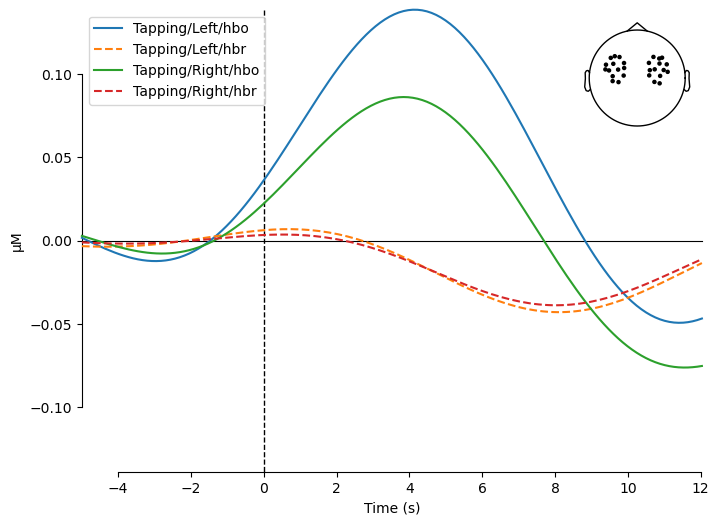

# Fast-fnirs

A package for fast fNIRS analysis.

Currently offers:

1. Processing from BIDS to MNE epochs
2. Subject-specific and cross-subject classification
3. Simple visualization

## Example 

```python
import numpy as np
import pandas as pd
from pathlib import Path
import matplotlib.pyplot as plt
import seaborn as sns
import logging
import mne
import mne_nirs
from mne_bids import BIDSPath, read_raw_bids, stats as mne_bids_stats
logger = logging.getLogger(__name__)

from fastfnirs.bids_to_mne import bids_to_mne
from fastfnirs.classification import epoch_classification
from fastfnirs.visualization import plot_evoked
from fastfnirs.utils import get_subjects, get_tasks, get_ch_type
```


```python
datapath = mne_nirs.datasets.fnirs_motor_group.data_path()
root_path = datapath
```


```python
subjects = get_subjects(root_path)
process_raw_kwargs = dict(
    h_freq=0.1,
    l_freq=0.01,
    sci_threshold=0.5,
    verbose=False,
)
epochs_kwargs = dict(
    tmin=-5,
    tmax=12,
)
epochs_dict = bids_to_mne(
    root_path,
    process_raw_kwargs=process_raw_kwargs,
    epochs_kwargs=epochs_kwargs,
)
epochs_dict = epochs_dict['tapping']
```


```python
event_mapping = {
    'Tapping/Left': 0,
    'Tapping/Right': 1,
    # 'Control': 2,
}
clf_res = epoch_classification(
    epochs_dict,
    event_mapping,
    features=['MV'],
    n_windows=3,
    print_report=True,
)
```

    X.shape: (300, 84), y label counts: (array([0., 1.]), array([150, 150]))
    Individual subject classification:
                   precision    recall  f1-score   support
    
     Tapping/Left       0.84      0.89      0.87       150
    Tapping/Right       0.89      0.83      0.86       150
    
         accuracy                           0.86       300
        macro avg       0.86      0.86      0.86       300
     weighted avg       0.86      0.86      0.86       300
    
    [[134  16]
     [ 25 125]]
    
    Class accuracies (ind):
    Tapping/Left: 0.893
    Tapping/Right: 0.833
    
    Cross-subject classification:
                   precision    recall  f1-score   support
    
     Tapping/Left       0.74      0.82      0.78       150
    Tapping/Right       0.80      0.71      0.75       150
    
         accuracy                           0.76       300
        macro avg       0.77      0.76      0.76       300
     weighted avg       0.77      0.76      0.76       300
    
    [[123  27]
     [ 44 106]]
    
    Class accuracies (comb):
    Tapping/Left: 0.820
    Tapping/Right: 0.707


```python
plot_evoked(epochs_dict, conditions=list(event_mapping.keys()))
```


    

    

```python
# connecting to metadata example
df = pd.merge(
    pd.DataFrame(np.c_[clf_res['ind_preds'], clf_res['comb_preds'], clf_res['epoch_ids']], columns=['ind_pred', 'comb_pred', 'epoch']),
    clf_res['metadata'],
    on='epoch',
)

for subject in df['subject'].unique():
    comb_sub_acc = df[df['subject'] == subject].apply(lambda x: x['comb_pred'] == event_mapping[x['trial_type']], axis=1).mean()
    print(f'Cross-subject accuracy for {subject} is     {comb_sub_acc:.2f}')

print()
for subject in df['subject'].unique():
    ind_sub_acc = df[df['subject'] == subject].apply(lambda x: x['ind_pred'] == event_mapping[x['trial_type']], axis=1).mean()
    print(f'Subject specific accuracy for {subject} is  {ind_sub_acc:.2f}')
```

    Cross-subject accuracy for sub-01 is     0.73
    Cross-subject accuracy for sub-02 is     0.70
    Cross-subject accuracy for sub-03 is     0.62
    Cross-subject accuracy for sub-04 is     0.98
    Cross-subject accuracy for sub-05 is     0.78
    
    Subject specific accuracy for sub-01 is  0.87
    Subject specific accuracy for sub-02 is  0.87
    Subject specific accuracy for sub-03 is  0.67
    Subject specific accuracy for sub-04 is  0.97
    Subject specific accuracy for sub-05 is  0.95

